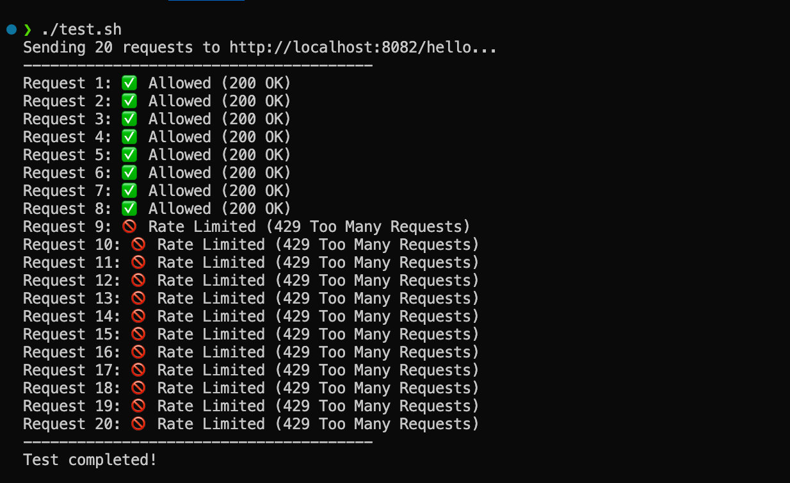

# Rate Limiting Example with Spring Cloud Gateway and Redis

This project demonstrates how to implement **rate limiting** in a microservices architecture using **Spring Cloud Gateway** and **Redis**.



## 🚀 **Overview**
The setup includes:
1. **API Gateway** (Port: 8082): Routes requests and enforces rate limits.
2. **Microservice** (Port: 8080): A simple Spring Boot application responding to `/hello`.
3. **Redis**: Used by the API Gateway to store rate-limiting data.

### **Key Features**
- Protects APIs from abuse and traffic spikes.
- Implements IP-based rate limiting.
- Allows 5 requests per second with a burst capacity of 10 requests.

---

## 🛠️ **Setup and Installation**

### **1. Prerequisites**
- Java 17+
- Docker (for Redis)
- Maven

### **2. Clone the Repository**
```bash
git clone https://github.com/ShanukaLakshan/SpringBoot-Rate-Limit---Api-Gateway.git
cd api-gateway && mvn clean install && mvn spring-boot:run
cd microservice && mvn clean install && mvn spring-boot:run
```

## 📚 Technologies Used
- **Spring Boot**: For building the microservice and API Gateway.
- **Spring Cloud Gateway**: For routing and rate limiting.
- **Redis**: As a backend for storing rate limit tokens.
- **Docker**: For running Redis.

## 💡 Future Enhancements
- Add user-based rate limiting.
- Implement dynamic rate limits based on roles.
- Monitor rate limits using observability tools like Prometheus and Grafana.

## 🙌 Contributing
Feel free to submit issues or pull requests to improve the project.
